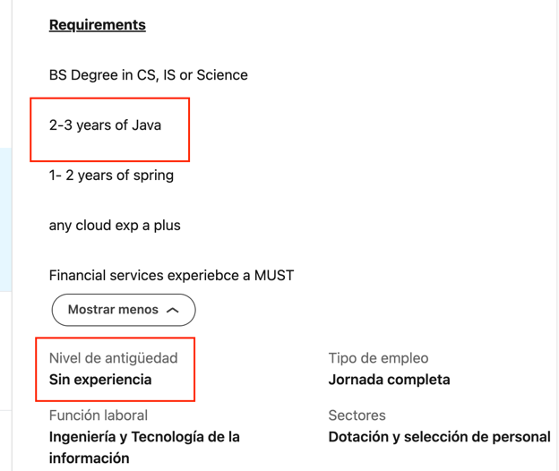
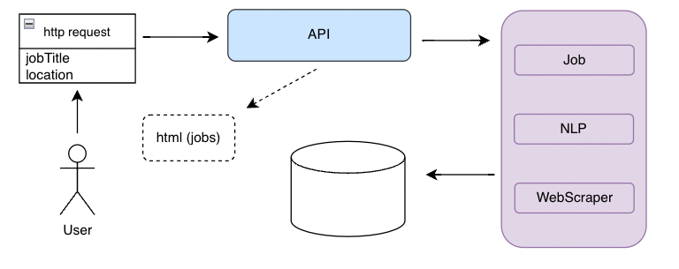
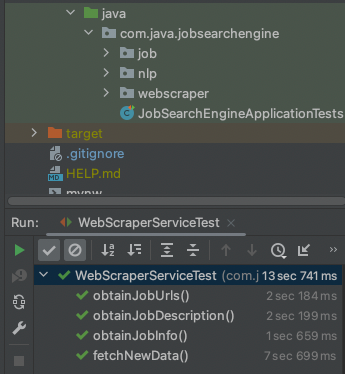

Job-Search-Engine
-
***
### About
The main purpose of this app is to optimize job search with NLP. The key elements of the project include:

* Java and Spring Boot
* Apache Kafka for messaging queue
* Open NLP for language processing in the Business Layer
* JSoup and Selenium for HTML/Web Scraping
* MongoDB for the Database
* Spring Web for minimal frontend
* 
The LinkedIn experience filter is known to be unreliable, as shown in the picture below:

***
### Architecture

The project follows an N-Tier layered architecture, distributed as follows:
- Entity/Model/POJO layers
- Controller Layers
- Service Layers
- Database

The overview of the architecture is depicted below:

***
### Web Scrapper

Web scraping is performed using Selenium. Currently, there is only support for Google Chrome, but it is intended to provide support for other browsers.
The current version (v1) only supports a quick call for 25 jobs. There is still room for improvement as filters and Business Logic.
***
### Database
**Database Installation and config**

- **install mongodb:** You may want to refer to this website: https://github.com/mongodb/homebrew-brew. I used, 'brew install mongodb-community' since it includes the mongo shell, which
makes interaction easier.
- **Configure application.properties** to connect Spring Boot app to mongodb
- **Configure mongod.conf**. In Mac: go to finder, Comand + Shift +G and paste "/opt/homebrew/etc/mongod.conf". By default, mongodb has no auth enabled, and if you specify it in the application.properties, you may get an error.

**Database commands**
- **_Start db:_** brew services start mongodb-community
- **_Stop db:_** brew services stop mongodb-community
- **_Restart db:_** brew services stop mongodb-community
- **_Check service status:_** brew services list
- **Check if mongodb is listening** on default port 27017: sudo lsof -i :27017
- **_To uninstall:_** (in case you mess it up): brew services uninstall mongodb-community

To check if there is any dbs created: 
- Go to terminal and enter "mongosh" if you have used step 1
- Enter 'show dbs'
  - If you have started application before creating manually the db, you will see that mongodb has created a db in the moment of startup.

More info: https://www.mongodb.com/docs/manual/tutorial/install-mongodb-on-os-x/

****

### JUnit
Unit tests have been implemented to test the services:

****
**Future Enhancements**
* Enhance the business logic for NlpService, specifically the scoreWords method, by adding replacements for newline characters (count, hasNext, then replace).
* Include support for other web browsers (Firefox, Safari, etc

